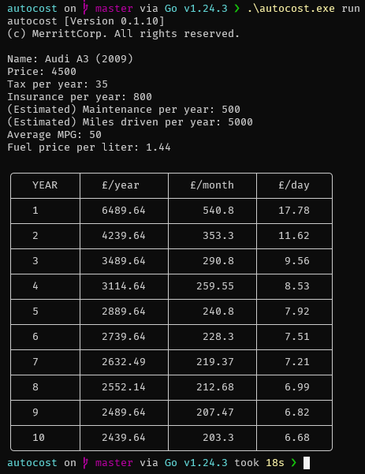

# `autocost`

Calculate the average monthly cost of owning an automobile over a given period of time.

Takes into account:

-   Car price
-   Vehicle tax (/year)
-   Estimated maintenance costs (/year)
-   Insurance (/year)
-   Fuel cost (using MPG, Fuel cost (/litre), and distance driven (/year))
-   How long you plan to keep the car (in years)

```sh
$ autocost run
```


